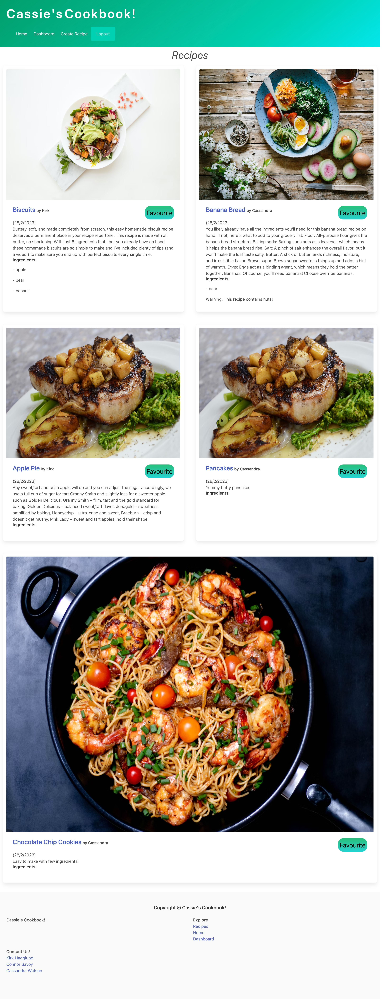

# Cassie's Cookbook 

## Description 📃

This is a website where you can view tones of recipes from a lot of different people. You can even signup so you yourself can post your own homemade recipes and favourite ones you want to cook in the future.

## Table of Contents

- [How to Install](#how-to-install🔌)
- [Usgae](#usage🔋)
- [Credits](#credits🙏🏻)
- [License](#license🔑)
- [Screenshot](#screenshot📸)

## How-to-Install🔌

GitHub Repo: [Cassie's Cookbook](https://github.com/Connor812/Project-2.git)

## Usage🔋

How to use. On the homepage, you have all the recipes displayed for you so you can sort through them. In the navbar at the top of the screen you have the option to login or signup into the webpage. Once you have logged in or created an account, you are able to favourite any recipe's you like. Also in the navbar you have the option now to create your own recipes now. Just fill out the form with information and click the submit button. In the dashboard, you can view all of the recipes that you have created and saved! And finally, say that you want to leave the sight you have the option to logout.

## Credits🙏🏻

Huge shoutout to the team Kirk, Cassie, and Connor for coming together and working on this project! Also to the University of Toronto for teaching us all how to code.

## License🔑

[GNU GENERAL PUBLIC LICENSE Version 3, 29 June 2007](https://www.gnu.org/licenses)

## Screenshot📸

